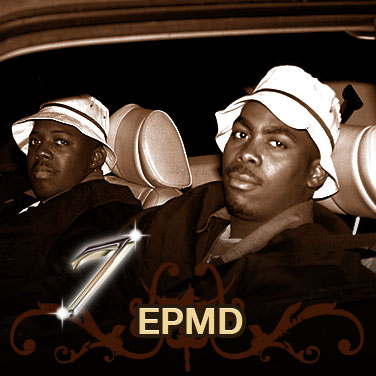
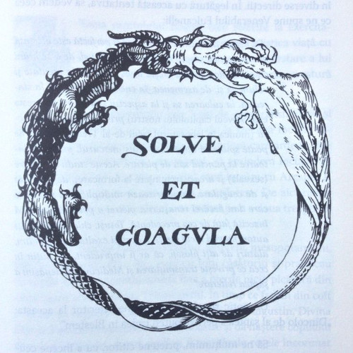

#HSLIDE
## Дистрибутиран Elixir

#HSLIDE


#HSLIDE
* Дистрибутираност значи програмата ни да върви на повече от една виртуални машини.
* Elixir ни дава добри инструменти за постигане на това. <!-- .element: class="fragment" -->

#HSLIDE
* Виртуалните машини на Elang/Elixir наричаме nodes.
* Един node е една виртуална машина. <!-- .element: class="fragment" -->
* Те може да са отворени за комуникация с други node-ове или не. <!-- .element: class="fragment" -->

#HSLIDE
### Функции за статус на node
* Как да видим името на node-a си? <!-- .element: class="fragment" -->
* Как да направим node-а си 'жив'? <!-- .element: class="fragment" -->

#HSLIDE
### Свързване на node-ове
* Списък на свързаните node-ове. <!-- .element: class="fragment" -->
* Свързване на node-ове. <!-- .element: class="fragment" -->
* Връзките между node-ове са транзитивни. <!-- .element: class="fragment" -->

#HSLIDE
### Създаване на процеси на отдалечени node-ове
* Node.spawn и неговите версии. <!-- .element: class="fragment" -->
* Основата на комуникацията между node-ове са процесите. <!-- .element: class="fragment" -->

#HSLIDE
### Наблюдаване на Node-ове

```elixir
Node.monitor(some_node, true)
```

#HSLIDE
### Извикване на отдалечени функции
* Използва се Erlang модула :rpc. <!-- .element: class="fragment" -->
* Отдолу работим с процеси. <!-- .element: class="fragment" -->
* :rpc.call и :rpc.cast. <!-- .element: class="fragment" -->
* async_call, yield и nb_yield. <!-- .element: class="fragment" -->
* multicall и multicast. <!-- .element: class="fragment" -->

#HSLIDE
## EPMD


#HSLIDE
* Когато стартираме node с име или пък му дадем име в последствие, той ще се свърже към програма, наречена EPMD или Erlang Port Mapper Daemon.
* Такава програма върви на всеки компютър на който има поне един 'жив' Erlang или Elixir node.

#HSLIDE
* EPMD е нещо като сървър за имена, който позволява регистриране, комуникация и връзка между node-ове.
* EPMD map-ва имена на node-ове към машинни адреси. <!-- .element: class="fragment" -->
* Програмата пази само name частта от name@host, защото си знае хоста. <!-- .element: class="fragment" -->

#HSLIDE
### Кога се стартира EPMD?

* Ако няма вървящ EPMD и стартираме node с име, автоматично се стартира. <!-- .element: class="fragment" -->
* Портът му по подразбиране е 4369, но може да се конфигурира друг. <!-- .element: class="fragment" -->
* Не е добра идея, защото Ericsson са го регистрирати официално за EPMD и би трябвало да е свободен. <!-- .element: class="fragment" -->

#HSLIDE
```bash
iex --sname andi --erl \
  "-kernel inet_dist_listen_min 54300 inet_dist_listen_max 54400"
```

#HSLIDE
## PID


#HSLIDE
```elixir
# От valo@meddland

Node.spawn(
  :meddle@meddland,
  fn -> send(pid(0, 86, 0), "Hello from valo!") end
)
# #PID<9107.110.0>
```

#HSLIDE
* Това, което Node.spawn/2 връща е pid, но изглежда малко странно.
* Свикнали сме първото число да е 0, а тук не е. <!-- .element: class="fragment" -->
* Това е така защото първото число на pid-а е свързано с node-а, на който процеса му се изпълнява. <!-- .element: class="fragment" -->

#HSLIDE
* Ако процесът върви на текущия node, то винаги е 0.
* Ако обаче процесът върви на друг node, числото уникално ще идентифицира този друг node. <!-- .element: class="fragment" -->
* Тази стойност за един и същи node ще е различна на различни node-ове, свързани с него. <!-- .element: class="fragment" -->

#HSLIDE
### Типа данни PID

* Първото число на pid показва на кой node върви процеса.
* Второто е брояч, а третото допълнение към този брояч.
* Когато минем максималния брой процеси за дадения node, третото число се увеличава с едно.

#HSLIDE
### Демонстрация

```elixir
binary_pid = :erlang.term_to_binary(pid)
```

#HSLIDE
## Дистрибутирани програми - проблемите

#HSLIDE


#HSLIDE
* На мрежата не винаги може да се разчита. Node-ове могат да изчезнат.
* Мрежата може да бъде бавна от време на време. Резултатите от извиквания могат да се забавят. <!-- .element: class="fragment" -->
* Bandwidth. Малки и прости съобщения! <!-- .element: class="fragment" -->
* Security. Това трябва да си го постигнем сами! <!-- .element: class="fragment" -->

#HSLIDE
* Топологията на мрежата не е константа - имена и локации - трябва да внимаваме.
* Рядко ние имаме пълен контрол над физическите машини в мрежата. <!-- .element: class="fragment" -->
* Транспортът е скъп. Малки, прости съобщения! <!-- .element: class="fragment" -->
* Мрежата няма определен формат. Трябва ние да определим формат и протокол. <!-- .element: class="fragment" -->

#HSLIDE


#HSLIDE
## Край...

